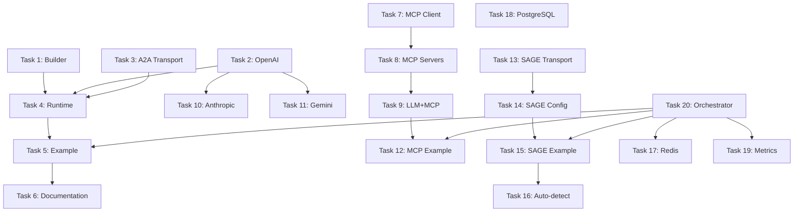

# SAGE ADK Task List
**Version**: 1.0
**Date**: 2025-10-07
**Status**: Active Development Plan

## Current Status

### ✅ Phase 1: Foundation (Completed)
- [x] Core types (pkg/types)
- [x] Error handling (pkg/errors)
- [x] Configuration (config/)
- [x] Agent interface (core/agent)
- [x] Protocol layer (core/protocol)
- [x] A2A adapter stub (adapters/a2a)
- [x] SAGE adapter stub (adapters/sage)
- [x] LLM provider interface + Mock (adapters/llm)
- [x] Storage interface + Memory (storage/)

**Test Coverage**: 90%+ ✅
**Problem**: 동작하는 agent를 만들 수 없음 ❌

---

## 🎯 Phase 2A: Make It Work (Priority 0 - 2 Weeks)

**Goal**: 5줄로 동작하는 AI agent 만들기

### Week 1: Builder + LLM

#### Task 1: Builder API Implementation (3 days)
**Priority**: P0 - Critical
**Files**:
```
builder/
├── builder.go         # Fluent API
├── builder_test.go    # Unit tests
├── defaults.go        # Zero-config defaults
├── validator.go       # Build validation
└── doc.go            # Package documentation
```

**Requirements**:
```go
// Must support:
agent := adk.NewAgent("my-agent").Build()                    // Minimal
agent := adk.NewAgent("my-agent").WithLLM(llm.OpenAI()).Build()  // With LLM
agent := adk.NewAgent("my-agent").
    WithLLM(llm.OpenAI()).
    WithStorage(storage.Memory()).
    WithProtocol(adk.ProtocolA2A).
    Build()  // Full config
```

**Acceptance Criteria**:
- [ ] Fluent API works
- [ ] Defaults are sensible (A2A, Memory, no LLM)
- [ ] Validation prevents invalid configs
- [ ] Test coverage ≥ 90%
- [ ] Documentation with examples

**Dependencies**: None (can start immediately)

---

#### Task 2: OpenAI Provider Implementation (2 days)
**Priority**: P0 - Critical
**Files**:
```
adapters/llm/
├── openai.go          # OpenAI client
├── openai_test.go     # Tests with mock API
├── stream.go          # Streaming support
└── errors.go          # Error handling
```

**Requirements**:
```go
// Must support:
provider := llm.OpenAI()  // From env: OPENAI_API_KEY
provider := llm.OpenAI(llm.Config{
    APIKey: "sk-...",
    Model:  "gpt-4",
})

resp, err := provider.Complete(ctx, &llm.CompletionRequest{
    Messages: []llm.Message{
        {Role: llm.RoleUser, Content: "Hello"},
    },
})

// Streaming
err := provider.Stream(ctx, req, func(chunk string) error {
    fmt.Print(chunk)
    return nil
})
```

**Acceptance Criteria**:
- [ ] Completion API works
- [ ] Streaming API works
- [ ] Error handling (rate limits, invalid key, etc.)
- [ ] Test coverage ≥ 85% (with mocks)
- [ ] Environment variable support

**Dependencies**: None (can start immediately)

---

#### Task 3: A2A Transport Layer (3 days)
**Priority**: P0 - Critical
**Files**:
```
adapters/a2a/
├── transport.go       # HTTP client/server
├── transport_test.go  # Integration tests
├── client.go          # HTTP client wrapper
├── server.go          # HTTP server implementation
└── connection.go      # Connection pooling
```

**Requirements**:
```go
// Client side:
client := a2a.NewClient(a2a.ClientConfig{
    ServerURL: "http://agent-b:8080",
    Timeout:   30 * time.Second,
})
err := client.SendMessage(ctx, msg)

// Server side:
server := a2a.NewServer(a2a.ServerConfig{
    Port: 8080,
    Handler: handleMessage,
})
server.Start()
```

**Acceptance Criteria**:
- [ ] HTTP client initialized correctly
- [ ] HTTP server receives messages
- [ ] Connection pooling works
- [ ] Retry logic for failures
- [ ] Test coverage ≥ 85%
- [ ] Integration test with 2 agents

**Dependencies**: None (current adapter.go has conversion logic)

---

### Week 2: Runtime + Example

#### Task 4: Agent Runtime (3 days)
**Priority**: P0 - Critical
**Files**:
```
core/agent/
├── runtime.go         # Agent execution loop
├── runtime_test.go    # Runtime tests
├── lifecycle.go       # Start/Stop/Shutdown
├── context.go         # Context management
└── middleware.go      # Middleware support
```

**Requirements**:
```go
// Simple usage:
agent := adk.NewAgent("my-agent").
    OnMessage(func(ctx context.Context, msg *adk.Message) error {
        return msg.Reply("Hello!")
    }).
    Build()

agent.Start(":8080")  // Blocking

// Advanced usage:
agent.StartBackground(":8080")
// ... do other work ...
agent.Shutdown(ctx)  // Graceful shutdown
```

**Acceptance Criteria**:
- [ ] Message routing works
- [ ] OnMessage handler called correctly
- [ ] Graceful shutdown (drain in-flight requests)
- [ ] Context propagation
- [ ] Error handling and recovery
- [ ] Test coverage ≥ 90%

**Dependencies**: Task 1 (Builder), Task 3 (A2A Transport)

---

#### Task 5: Simple Chatbot Example (2 days)
**Priority**: P0 - Critical
**Files**:
```
examples/simple-chatbot/
├── main.go            # 5-10 lines of code
├── README.md          # Setup instructions
├── .env.example       # Environment template
├── test.sh            # Test script
└── Dockerfile         # Optional containerization
```

**Requirements**:
```go
// main.go (target: 5-10 lines)
package main

import (
    "context"
    "github.com/sage-x-project/sage-adk/adk"
    "github.com/sage-x-project/sage-adk/adapters/llm"
)

func main() {
    agent := adk.NewAgent("chatbot").
        WithLLM(llm.OpenAI()).
        OnMessage(func(ctx context.Context, msg *adk.Message) error {
            response, _ := msg.LLM().Complete(ctx, msg.Text())
            return msg.Reply(response)
        }).
        Build()

    agent.Start(":8080")
}
```

**Test Script**:
```bash
#!/bin/bash
# test.sh
curl -X POST http://localhost:8080/message \
  -H "Content-Type: application/json" \
  -d '{"message": {"role": "user", "parts": [{"kind": "text", "text": "Hello!"}]}}'
```

**Acceptance Criteria**:
- [ ] Example runs in < 10 commands from clone
- [ ] README is clear and accurate
- [ ] Test script works
- [ ] Environment variables documented
- [ ] Error messages are helpful
- [ ] **Success**: External developer can run it in 15 minutes

**Dependencies**: Task 1, 2, 3, 4 (all previous tasks)

---

#### Task 6: Documentation & Polishing (2 days)
**Priority**: P0 - Critical
**Files**:
```
docs/
├── quickstart.md      # 5-minute guide
├── concepts.md        # Core concepts
├── api-reference.md   # API documentation
└── troubleshooting.md # Common issues
```

**Requirements**:
- Quick Start guide (5 minutes to working agent)
- Concepts explanation (Agent, Protocol, LLM, Message)
- API reference (Builder methods, Message API)
- Troubleshooting (API key errors, port conflicts, etc.)

**Acceptance Criteria**:
- [ ] Quick Start tested by external developer
- [ ] All code examples work
- [ ] Common errors documented
- [ ] GoDocs complete for all public APIs

**Dependencies**: Task 5 (Example must work first)

---

## 🚀 Phase 2B: Add Intelligence (Priority 1 - 2 Weeks)

**Goal**: LLM이 도구를 사용할 수 있게 하기 (MCP)

### Week 3: MCP Foundation

#### Task 7: MCP Client Implementation (4 days)
**Priority**: P1 - High
**Files**:
```
adapters/mcp/
├── client.go          # MCP client
├── client_test.go     # Client tests
├── types.go           # MCP types
├── protocol.go        # JSON-RPC 2.0
└── doc.go            # Documentation
```

**Requirements**:
```go
// Usage:
mcpClient := mcp.NewClient()
mcpClient.AddServer("filesystem", mcp.ServerConfig{
    Command: "npx",
    Args:    []string{"-y", "@modelcontextprotocol/server-filesystem", "/data"},
})

tools, err := mcpClient.ListTools(ctx)
result, err := mcpClient.ExecuteTool(ctx, "read_file", map[string]interface{}{
    "path": "/data/readme.txt",
})
```

**Acceptance Criteria**:
- [ ] JSON-RPC 2.0 communication works
- [ ] Tool discovery (ListTools)
- [ ] Tool execution (ExecuteTool)
- [ ] Error handling
- [ ] Test coverage ≥ 85%

**Dependencies**: None (independent)

---

#### Task 8: MCP Server Implementations (3 days)
**Priority**: P1 - High
**Files**:
```
adapters/mcp/
├── servers/
│   ├── filesystem.go  # File system server
│   ├── websearch.go   # Web search server
│   └── http.go        # HTTP client server
└── servers_test.go
```

**Requirements**:
- File System: read_file, write_file, list_directory
- Web Search: search (using Google/Bing API)
- HTTP: fetch_url, post_data

**Acceptance Criteria**:
- [ ] 3 MCP servers implemented
- [ ] Each server tested independently
- [ ] Integration with MCP client
- [ ] Test coverage ≥ 80%

**Dependencies**: Task 7 (MCP Client)

---

#### Task 9: LLM + MCP Integration (3 days)
**Priority**: P1 - High
**Files**:
```
adapters/llm/
├── tools.go           # Tool integration
├── function_call.go   # Function calling
└── mcp_integration.go # MCP-LLM bridge
```

**Requirements**:
```go
// LLM automatically uses MCP tools:
agent := adk.NewAgent("smart-agent").
    WithLLM(llm.OpenAI()).
    WithMCP(mcp.Servers(
        mcp.FileSystem("/data"),
        mcp.WebSearch(),
    )).
    Build()

// When user asks "What files are in /data?",
// LLM uses MCP filesystem tool automatically
```

**Acceptance Criteria**:
- [ ] LLM function calling works
- [ ] MCP tools auto-discovered
- [ ] Tool results fed back to LLM
- [ ] Multi-turn conversations
- [ ] Test coverage ≥ 85%

**Dependencies**: Task 7, 8 (MCP Client + Servers)

---

### Week 4: More LLMs + Example

#### Task 10: Anthropic Provider (2 days)
**Priority**: P1 - High
**Files**:
```
adapters/llm/
├── anthropic.go       # Claude integration
└── anthropic_test.go
```

**Requirements**:
```go
provider := llm.Anthropic()  // From ANTHROPIC_API_KEY
provider := llm.Anthropic(llm.Config{
    APIKey: "sk-ant-...",
    Model:  "claude-3-5-sonnet-20241022",
})
```

**Acceptance Criteria**:
- [ ] Completion API works
- [ ] Streaming works
- [ ] Function calling works
- [ ] Test coverage ≥ 85%

**Dependencies**: Task 2 (OpenAI pattern)

---

#### Task 11: Gemini Provider (2 days)
**Priority**: P1 - High
**Files**:
```
adapters/llm/
├── gemini.go          # Gemini integration
└── gemini_test.go
```

**Requirements**:
```go
provider := llm.Gemini()  // From GOOGLE_API_KEY
provider := llm.Gemini(llm.Config{
    APIKey: "...",
    Model:  "gemini-pro",
})
```

**Acceptance Criteria**:
- [ ] Completion API works
- [ ] Streaming works
- [ ] Function calling works
- [ ] Test coverage ≥ 85%

**Dependencies**: Task 2 (OpenAI pattern)

---

#### Task 12: MCP Agent Example (2 days)
**Priority**: P1 - High
**Files**:
```
examples/mcp-agent/
├── main.go
├── README.md
├── test.sh
└── mcp-config.yaml
```

**Requirements**:
```go
// Agent that uses MCP tools
agent := adk.NewAgent("file-assistant").
    WithLLM(llm.OpenAI()).
    WithMCP(mcp.Servers(
        mcp.FileSystem("/workspace"),
        mcp.WebSearch(),
    )).
    OnMessage(handleMessage).
    Build()
```

**Test Cases**:
- "List files in /workspace"
- "Read content of README.md"
- "Search for Go best practices"

**Acceptance Criteria**:
- [ ] Example works end-to-end
- [ ] README with setup instructions
- [ ] Test script validates functionality
- [ ] Screenshots/demo output

**Dependencies**: Task 9 (LLM+MCP Integration)

---

## 🔐 Phase 2C: Add Security (Priority 2 - 2 Weeks)

**Goal**: SAGE 보안 프로토콜 완전 통합

### Week 5: SAGE Core

#### Task 13: SAGE Transport Layer (5 days)
**Priority**: P2 - Medium
**Files**:
```
adapters/sage/
├── transport.go       # Handshake implementation
├── transport_test.go
├── handshake.go       # 4-phase handshake
├── session.go         # Session management
└── encryption.go      # Message encryption
```

**Requirements**:
- Implement 4-phase handshake (Invitation → Request → Response → Complete)
- HPKE-based key agreement
- Session management
- Message signing/verification (RFC 9421)

**Acceptance Criteria**:
- [ ] Handshake completes successfully
- [ ] Sessions created and managed
- [ ] Messages encrypted/decrypted
- [ ] Signatures verified
- [ ] Test coverage ≥ 80%
- [ ] Integration test with SAGE library

**Dependencies**: None (uses existing sage library)

---

#### Task 14: SAGE Configuration (2 days)
**Priority**: P2 - Medium
**Files**:
```
adapters/sage/
├── config.go          # Configuration
├── did.go             # DID management
├── keys.go            # Key loading
└── blockchain.go      # Blockchain connection
```

**Requirements**:
```go
// Usage:
sageConfig := sage.Config{
    DID:             "did:sage:ethereum:0x...",
    Network:         sage.NetworkEthereum,
    RPCEndpoint:     "https://eth-mainnet.g.alchemy.com/v2/...",
    ContractAddress: "0x...",
    PrivateKeyPath:  "keys/agent.key",
}

agent := adk.NewAgent("secure-agent").
    WithProtocol(adk.ProtocolSAGE).
    WithSAGE(sageConfig).
    Build()
```

**Acceptance Criteria**:
- [ ] DID resolution from blockchain
- [ ] Key loading (Ed25519, Secp256k1, X25519)
- [ ] Blockchain connection validated
- [ ] Error handling for invalid config
- [ ] Test coverage ≥ 85%

**Dependencies**: Task 13 (SAGE Transport)

---

### Week 6: SAGE Example + Testing

#### Task 15: SAGE Example (3 days)
**Priority**: P2 - Medium
**Files**:
```
examples/secure-agent/
├── main.go
├── README.md
├── scripts/
│   ├── setup-blockchain.sh
│   ├── generate-keys.sh
│   └── register-did.sh
├── docker-compose.yml  # Local blockchain
└── test.sh
```

**Requirements**:
- Local blockchain setup (Hardhat/Ganache)
- Key generation scripts
- DID registration
- Secure agent communication demo

**Acceptance Criteria**:
- [ ] Setup scripts work
- [ ] Agent registers on blockchain
- [ ] Secure handshake completes
- [ ] Messages signed and verified
- [ ] README with full instructions
- [ ] Works on fresh machine

**Dependencies**: Task 13, 14 (SAGE Transport + Config)

---

#### Task 16: Protocol Auto-Detection Testing (2 days)
**Priority**: P2 - Medium
**Files**:
```
examples/hybrid-agent/
├── main.go           # Auto-detect A2A vs SAGE
├── README.md
└── test.sh
```

**Requirements**:
```go
// Agent auto-switches between A2A and SAGE
agent := adk.NewAgent("hybrid").
    WithProtocol(adk.ProtocolAuto).  // Auto-detect
    WithSAGE(sage.Optional()).       // Only if needed
    WithLLM(llm.OpenAI()).
    Build()

// Handles both:
// - A2A messages (no security field)
// - SAGE messages (with security field)
```

**Acceptance Criteria**:
- [ ] Auto-detection works
- [ ] A2A messages processed correctly
- [ ] SAGE messages processed correctly
- [ ] Fallback behavior tested
- [ ] Test coverage ≥ 85%

**Dependencies**: Task 13, 14, 15

---

## 📦 Phase 2D: Production Ready (Priority 3 - 2 Weeks)

**Goal**: 프로덕션 환경에서 사용 가능하게

### Week 7: Storage Backends

#### Task 17: Redis Storage (3 days)
**Priority**: P3 - Low
**Files**:
```
storage/
├── redis.go           # Redis implementation
├── redis_test.go
└── redis_pool.go      # Connection pooling
```

**Requirements**:
```go
// Usage:
redisClient := redis.NewClient(&redis.Options{
    Addr: "localhost:6379",
})

agent := adk.NewAgent("prod-agent").
    WithStorage(storage.Redis(redisClient)).
    Build()
```

**Features**:
- TTL support for message expiration
- Pub/Sub for agent coordination
- Connection pooling
- Retry logic

**Acceptance Criteria**:
- [ ] All Storage interface methods implemented
- [ ] TTL works correctly
- [ ] Pub/Sub tested
- [ ] Connection pooling validated
- [ ] Test coverage ≥ 85%

**Dependencies**: None (implements Storage interface)

---

#### Task 18: PostgreSQL Storage (3 days)
**Priority**: P3 - Low
**Files**:
```
storage/
├── postgres.go        # PostgreSQL implementation
├── postgres_test.go
├── migrations/        # Schema migrations
│   └── 001_initial.sql
└── schema.sql
```

**Requirements**:
```go
// Usage:
db, _ := sql.Open("postgres", "postgres://...")

agent := adk.NewAgent("enterprise-agent").
    WithStorage(storage.Postgres(db)).
    Build()
```

**Features**:
- Schema migrations
- Transaction support
- Indexing for performance
- JSONB for message storage

**Acceptance Criteria**:
- [ ] All Storage interface methods implemented
- [ ] Migrations tested
- [ ] Transactions work
- [ ] Performance benchmarked
- [ ] Test coverage ≥ 85%

**Dependencies**: None (implements Storage interface)

---

### Week 8: Observability + Production Example

#### Task 19: Metrics & Monitoring (2 days)
**Priority**: P3 - Low
**Files**:
```
observability/
├── metrics.go         # Prometheus metrics
├── logging.go         # Structured logging
├── tracing.go         # Distributed tracing
└── health.go          # Health checks
```

**Requirements**:
```go
// Usage:
agent := adk.NewAgent("monitored-agent").
    WithMetrics(prometheus.DefaultRegisterer).
    WithLogging(log.NewJSONLogger()).
    WithHealthCheck("/health").
    Build()
```

**Metrics**:
- Message count (by protocol, by status)
- LLM latency
- Storage operations
- Error rates

**Acceptance Criteria**:
- [ ] Prometheus metrics exposed
- [ ] Structured logging (JSON)
- [ ] Health check endpoint
- [ ] Test coverage ≥ 80%

**Dependencies**: None (independent)

---

#### Task 20: Multi-Agent Orchestrator Example (4 days)
**Priority**: P3 - Low
**Files**:
```
examples/orchestrator/
├── main.go
├── README.md
├── agents/
│   ├── root.go        # Orchestrator
│   ├── researcher.go  # Web search agent
│   ├── writer.go      # Content generation agent
│   └── reviewer.go    # QA agent
├── docker-compose.yml
└── k8s/               # Kubernetes manifests
```

**Requirements**:
- Root agent routes tasks to specialists
- Researcher agent uses MCP web search
- Writer agent uses LLM
- Reviewer agent validates output
- Full observability (metrics, logs, health)

**Acceptance Criteria**:
- [ ] 4 agents communicate via A2A
- [ ] Task routing works
- [ ] Docker Compose setup works
- [ ] Kubernetes deployment tested
- [ ] README with architecture diagram
- [ ] Demo video/screenshots

**Dependencies**: Most previous tasks (comprehensive example)

---

## 📊 Task Priority Matrix

### Critical Path (Blocking everything else)
```
Task 1 (Builder) → Task 4 (Runtime) → Task 5 (Example)
       ↓
Task 2 (OpenAI)
       ↓
Task 3 (A2A Transport)
```

### Parallel Tracks (Can work simultaneously)
```
Track 1 (LLM):     Task 2 → Task 10 → Task 11
Track 2 (MCP):     Task 7 → Task 8 → Task 9 → Task 12
Track 3 (SAGE):    Task 13 → Task 14 → Task 15 → Task 16
Track 4 (Storage): Task 17, Task 18 (independent)
Track 5 (Ops):     Task 19, Task 20 (independent)
```

### Dependencies Graph


---

## 🎯 Success Metrics

### Phase 2A Success (Week 2 End)
- [ ] Example runs: `go run main.go` works
- [ ] Test passes: `./test.sh` succeeds
- [ ] External test: Fresh developer builds agent in 30 min
- [ ] Documentation: README answers 80% of questions
- [ ] Coverage: ≥85% across all packages

### Phase 2 Complete Success (Week 8 End)
- [ ] 5 working examples (simple, MCP, SAGE, hybrid, orchestrator)
- [ ] 3 LLM providers (OpenAI, Anthropic, Gemini)
- [ ] 3 MCP servers (FileSystem, WebSearch, HTTP)
- [ ] 3 storage backends (Memory, Redis, PostgreSQL)
- [ ] Full observability (metrics, logs, health, tracing)
- [ ] Production deployment (Docker, K8s)
- [ ] Test coverage ≥90%

---

## 📅 Timeline Summary

| Week | Phase | Focus | Deliverable |
|------|-------|-------|-------------|
| 1 | 2A | Builder + LLM | Working OpenAI integration |
| 2 | 2A | Runtime + Example | **First working agent** ✨ |
| 3 | 2B | MCP Foundation | MCP client + servers |
| 4 | 2B | More LLMs | Anthropic, Gemini, MCP example |
| 5 | 2C | SAGE Core | Transport + handshake |
| 6 | 2C | SAGE Complete | Example + auto-detection |
| 7 | 2D | Storage | Redis + PostgreSQL |
| 8 | 2D | Production | Metrics + orchestrator |

**Total**: 8 weeks to production-ready framework

---

## 🚦 Decision Gates

### Gate 1: End of Week 2 (Phase 2A)
**Question**: Can we build a working agent in 5 lines?

**Pass Criteria**:
- [ ] Example runs without errors
- [ ] LLM responds correctly
- [ ] External developer succeeds in 30 min
- [ ] Test coverage ≥85%

**If PASS**: Proceed to Phase 2B
**If FAIL**: Stop, redesign, restart Phase 2A

---

### Gate 2: End of Week 4 (Phase 2B)
**Question**: Can LLM use tools effectively?

**Pass Criteria**:
- [ ] MCP integration works
- [ ] LLM uses tools automatically
- [ ] Multi-turn conversations work
- [ ] Test coverage ≥85%

**If PASS**: Proceed to Phase 2C
**If FAIL**: Simplify MCP, defer advanced features

---

### Gate 3: End of Week 6 (Phase 2C)
**Question**: Does SAGE security work?

**Pass Criteria**:
- [ ] Handshake completes
- [ ] Messages signed/verified
- [ ] Example works on fresh machine
- [ ] Test coverage ≥80%

**If PASS**: Proceed to Phase 2D
**If FAIL**: Mark SAGE as experimental, focus on A2A

---

### Gate 4: End of Week 8 (Phase 2D)
**Question**: Is it production-ready?

**Pass Criteria**:
- [ ] All examples work
- [ ] Documentation complete
- [ ] Metrics/observability working
- [ ] Deployment tested (Docker + K8s)
- [ ] Test coverage ≥90%

**If PASS**: Release v0.2.0, start Phase 3
**If FAIL**: Extend Phase 2D, fix critical issues

---

## 📝 Notes

### Task Assignment Strategy
- **Week 1-2**: Single developer, focus on quality
- **Week 3-4**: 2 developers (LLM track + MCP track)
- **Week 5-6**: 2 developers (SAGE track + Storage track)
- **Week 7-8**: 3 developers (Storage + Ops + Examples)

### Testing Strategy
- Unit tests: During task development
- Integration tests: End of each phase
- E2E tests: Week 2, 4, 6, 8
- External testing: Week 2 (critical), Week 8 (final)

### Documentation Strategy
- Code comments: During development
- API docs: Week 2, 4, 6, 8
- Examples: After feature complete
- Blog posts: Week 2 (announcement), Week 8 (launch)

---

**Document Version**: 1.0
**Last Updated**: 2025-10-07
**Next Review**: End of Week 2 (Phase 2A completion)
